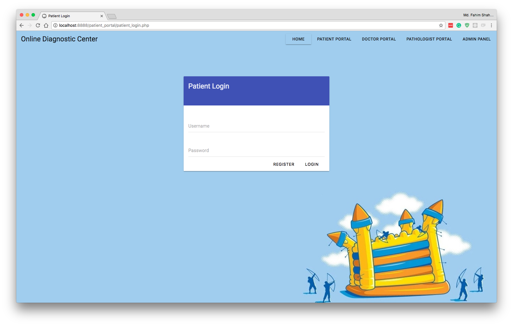
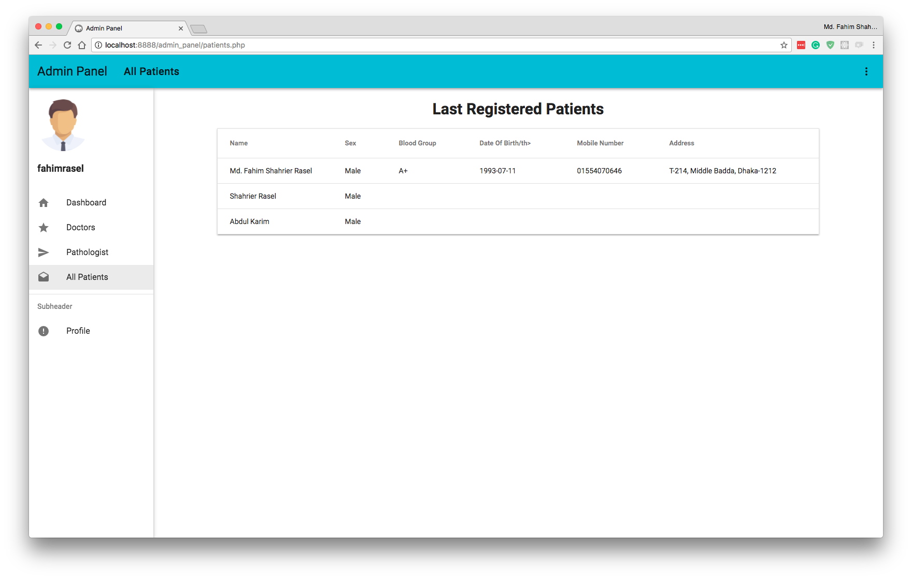

# Simple Online Diagnostic Center

Simple Online Diagnostice Center is a project of CSE411(Software Engineering). We did Requirment Elicitation Questionnaire, Requirement Engineering and Design Diagram like Sequence Diagram, Activity Diagram, Class Diagram etc.
Based on the analysis and the design we built this simple online diagnostic center.

#### What the project should do
* Patient can register
* Patient can make appointment to doctor
* Doctor will prescribed medicine and the patient see it online
* Patient can see test report online (Under Construction)
* Doctor can see patient medical history (To be Done)

#### Tools Used:

* PHP 5.6
* MySQL
* jQuery
* jQuery Form Validation
* [MDUI](https://www.mdui.org/)

### Screenshots

Index Page

Patient Registration

Patient Login

Patient Dashboard

Find Doctors

Patient Appointment Schedules

Patient Prescription

Patient's Profile

Patient's Doctor Appointment

Doctor Details

Doctor Dashboard

Doctor Schedules

Doctor Prescription

Admin Dashboard

Admin's Doctors Section

Admin's Pathologists Section

Admin's Patients Section

